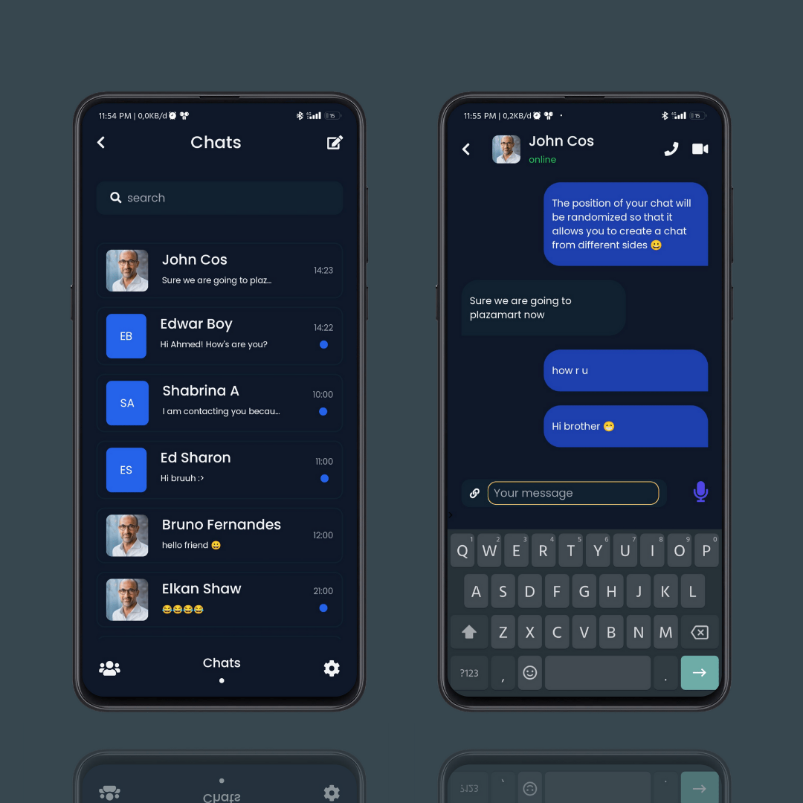

<h1 align="center">Chat App</h1>
<H2 align="center">Project UI / UX Design</H2>

<!-- Garis Lurus -->
 
<!-- End -->


<br>


<!-- Garis Lurus -->
 
<!-- End -->

## About
> This is my projects to make UI using front end tech like HTML, CSS, Javascript, React, React Native, and more.


## Responsive Test
<br>


<br>

## Languages and Tools
<br>

- Vue JS 3
- Tailwindcss
- Pinia state management
- Vue router
- Font Awesome 5
- Google Fonts Poppins
- Vite JS
- Git 
- Github
- Vercell
- Termux
- Micro Text Editor

### How to install
<br>

- <code>git clone ↆↆ </code>
  
  ```bash
  git clone https://github.com/bagussatoto/chat-application.git 
  ``` 
  
- <code>cd chat-app</code>
- <code>npm install</code>
- <code>npm run dev</code>

### Demo 
- 🚫  [Chat Application](https://chat-app-1-one.vercel.app/)

### Thanks You Support
- Support me with a cup of coffee and other snacks here → [Saweria.co](https://saweria.co/bagussatoto1)
- Don't forget to give me star in this repository 🙏🏻🙏🏻
- See my other instagram [@bagus_satoto1](http://www.instagram.com/bagus_satoto1)

> 🧑🏽‍💻 | [BAGUS BUDI SATOTO ](http://github.com/bagussatoto)
<br>
 